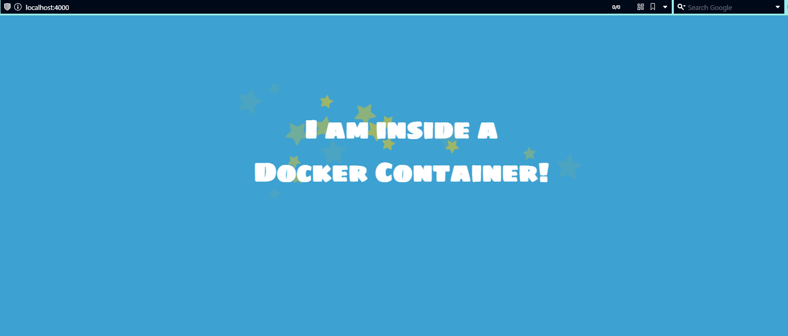

# Docker
week 4 of Applaudo Studios Program

## Description

Develop a docker container of a web server and publish it into a public registry,
providing both CI / CD for the image and the repository.

## Requirements

- [x] Create a docker container of a web server
- [x] Publish the image into a public registry
- [x] Provide CI / CD for the image and the repository

## Steps

1. Create a file and name it Dockerfile in your local directory
2. Build the image with the following command:

```bash
docker build -t website .
```
3. Run the image with the following command:

```bash
docker run -d --name nginx -p 8888:80 website
```

4. Check the container is running with the following command:

```bash
docker ps
```

5. Open your browser and go to http://localhost:8888 the website will look like this:


6. Push the image to Docker Hub with the following command:

```bash
docker push <your username>/website
```

7. Go to Docker Hub and check the image is there:


You can pull the image using the following command:

```bash
docker pull waltergsteven/website:latest
```

8. Finally, you can run the necessary commands by using the script.sh file: `./script.sh`

## CI/CD

The CI/CD is done using GitHub Actions, the workflow is the following:

1. When a pull request from the release branch to the develop branch is created, the branch workflow is triggered.
2. The branch workflow will delete the release branch once the pull request is merged.
3. When a push is made to the develop branch, the pr workflow is triggered.
4. The pr workflow will create a pull request from the develop branch to the release branch.
5. Once the pull request is merged, the docker-image workflow is triggered. 
6. The docker-image workflow will build the image and push it to Docker Hub.
